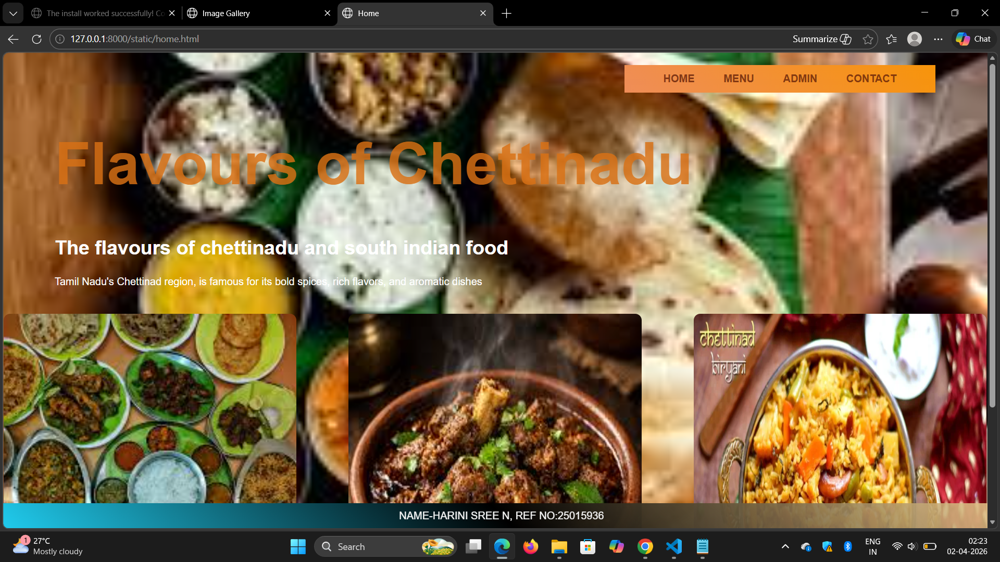
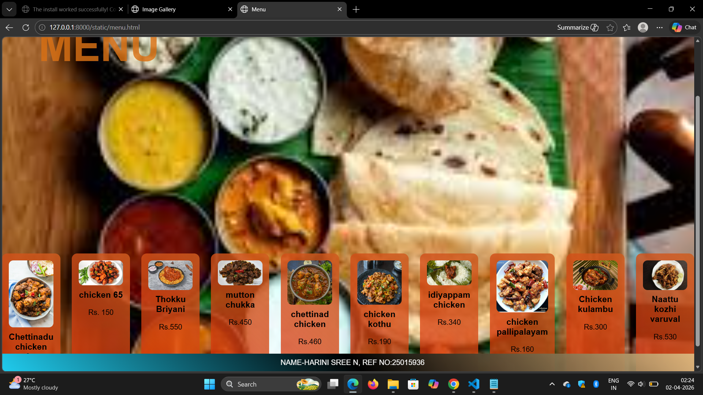
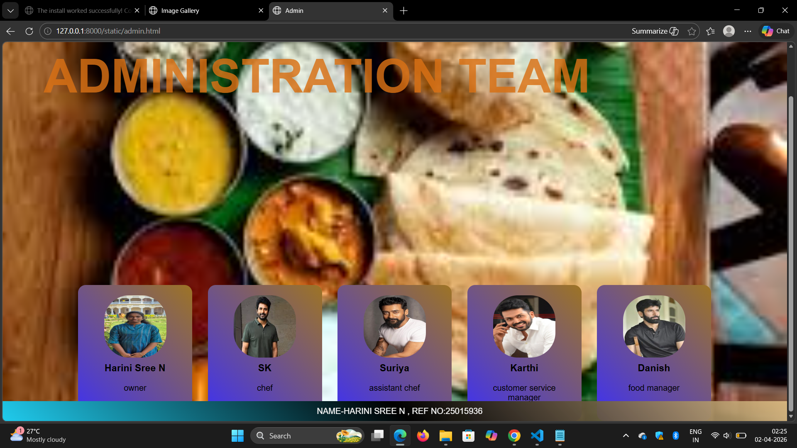
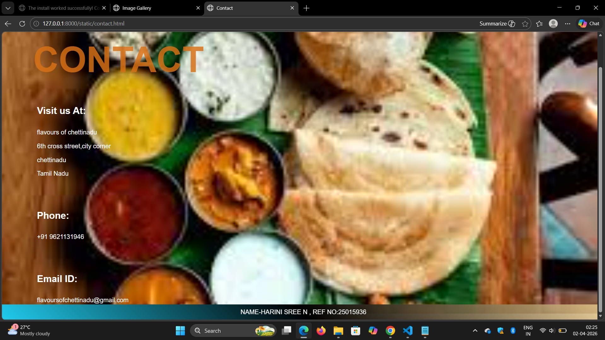

# Ex.06 Complex Problem: Restaurant Website
## Date:02.04.2026

## AIM:
To develop a static Restaurant website to display the food items and services provided by them.

## DESIGN STEPS:

### Step 1:
Requirement collection.

### Step 2:
Creating the layout using HTML and CSS.

### Step 3:
Updating the sample content.

### Step 4:
Choose the appropriate style and color scheme.

### Step 5:
Validate the layout in various browsers.

### Step 6:
Validate the HTML code.

### Step 7:
Publish the website in Localhost.


## PROGRAM:
home.html
```
<html>
    <head>
        <title>Home</title>
        <link rel="stylesheet" href="style.css">
    </head>
    <body>
        <nav>
            <a href="home.html">HOME</a>
            <a href="menu.html">MENU</a>
            <a href="admin.html">ADMIN</a>
            <a href="contact.html">CONTACT</a>
        </nav>
        <h1 class="main-title">Flavours of Chettinadu</h1>
        <h2 class="subtitle">The flavours of chettinadu and south indian food</h2>
        <p style="margin-left:80px;">
            Tamil Nadu's Chettinad region, is famous for its bold spices, rich flavors, and aromatic dishes
        </p>
        <div class="image-container">
            
            
            
        </div>
        <footer>NAME-HARINI SREE N, REF NO:25015936</footer>
    </body>
</html>
```

menu.html
```
<html>
    <head>
        <title>Menu</title>
        <link rel="stylesheet" href="style.css">
    </head>
    <body>
        <nav>
            <a href="home.html">HOME</a>
            <a href="menu.html">MENU</a>
            <a href="admin.html">ADMIN</a>
            <a href="contact.html">CONTACT</a>
        </nav>
        <h1 class="main-title">MENU</h1>
        <div class="menu-container">
            <div class="card">
                
                <h3>Chettinadu chicken fry</h3>
                <p>Rs.160</p>
            </div>
            
            <div class="card">
                
                <h3>chicken 65</h3>
                <p>Rs. 150</p>
            </div>

            <div class="card">
                
                <h3>Thokku Briyani</h3>
                <p>Rs.550</p>
            </div>
            <div class="card">
                
                <h3>mutton chukka</h3>
                <p>Rs.450</p>
            </div>
            
            <div class="card">
                
                <h3>chettinad chicken </h3>
                <p>Rs.460</p>
            </div>
            
            <div class="card">
                
                <h3>chicken kothu </h3>
                <p>Rs.190</p>
            </div>
            <div class="card">
                
                <h3>idiyappam chicken</h3>
                <p>Rs.340</p>
            </div>

            <div class="card">
                
                <h3>chicken pallipalayam</h3>
                <p>Rs.160</p>
            </div>

            <div class="card">
                
                <h3>Chicken kulambu</h3>
                <p>Rs.300</p>
            </div>

            <div class="card">
                
                <h3>Naattu kozhi varuval</h3>
                <p>Rs.530</p>
            </div>

        </div>

        <footer>NAME-HARINI SREE N, REF NO:25015936</footer>
    
    </body>
</html>
```
admin.html
```
<html>
    <head>
        <title>Admin</title>
        <link rel="stylesheet" href="style.css">
    </head>
    <body>
        <nav>
            <a href="home.html">HOME</a>
            <a href="menu.html">MENU</a>
            <a href="admin.html">ADMIN</a>
            <a href="contact.html">CONTACT</a>
        </nav>
        <h1 class="main-title">ADMINISTRATION TEAM</h1>
        <div class="team-container">
            <div class="team-card">
                
                <h3>Harini Sree N</h3>
                <p>owner</p>
            </div>
            <div class="team-card">
                
                <h3>SK</h3>
                <p>chef</p>

            </div>

            <div class="team-card">
                
                <h3>Suriya</h3>
                <p>assistant chef</p>
            </div>

            <div class="team-card">
                
                <h3>Karthi</h3>
                <p>customer service manager</p>
            </div>
            <div class="team-card">
                
                <h3>Danish</h3>
                <p>food manager </p>
            </div>
        </div>
        <footer>NAME-HARINI SREE N , REF NO:25015936</footer>
    </body>
</html>
```
contact.html
```
<html>
    <head>
        <title>Contact</title>
        <link rel="stylesheet" href="style.css">
    </head>
    <body>
        <nav>
            <a href="home.html">HOME</a>
            <a href="menu.html">MENU</a>
            <a href="admin.html">ADMIN</a>
            <a href="contact.html">CONTACT</a>
        </nav>
        <h1 class="main-title">CONTACT</h1>
        <div class="contact-box">
            <h2>Visit us At:</h2>
            <p>
                flavours of chettinadu
                <br>
                6th cross street,city corner
                <br>
                chettinadu
                <br>
                Tamil Nadu
            </p>
            <br>
            <h2>Phone:</h2>
            <p>+91 9621131946</p>
            <br>
            <h2>Email ID:</h2>
            <p>flavoursofchettinadu@gmail.com</p>
        </div>
        <footer>NAME-HARINI SREE N , REF NO:25015936</footer>
    </body>
</html>
```

## OUTPUT:






## RESULT:
The program for designing software company website using HTML and CSS is completed successfully.
